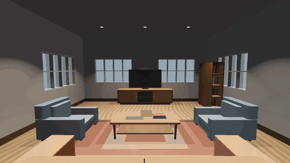

# The Lounge Handoff

One room, followed from a twelve-line recipe to a lit Cycles frame, a life-size Unreal level, a
walkable Godot project and a walkable web page. Everything in this repository is derived from
[`recipe.json`](recipe.json) by [mojulo](https://github.com/zombico/mojulo), a 3D factory for
agents: the agent builds worlds by conversation, as editable deterministic recipes, and the recipe
regenerates every file here on every read. Nothing below was authored by hand.

| Where to look | What it is |
| --- | --- |
| [`index.html`](index.html) | The handoff report: recipe → kernel → three engines → three edits, with the gates verbatim. This is the GitHub Pages front page. |
| [`walk/`](walk/) | The room as a self-contained three.js page, mojulo's own web tier. It opens on the aerial cutaway; the buttons top-left switch to the corner framing, fly, or walk. In walk, WASD moves and the mouse looks. No build step, no server beyond static hosting. On Pages: `/walk/`. |
| [`videos/`](videos/) | Representation videos, see below. |
| [`packs/`](packs/) | The engine handoffs: `godot-lit/`, `unity-lit/`, `unreal/`, and the lit glTF on its own. |
| [`gates/`](gates/) | What each machine gate measured, verbatim: the Godot handback JSON and log, the Unreal and Unity import and verify logs. |
| [`renders/`](renders/) | Cycles frames (day, night, dusk, before and after each edit) and the two Godot frames from the kernel fix. |

## The recipe

```json
{
  "title": "One-room house plan — living",
  "kind": "floorplan",
  "width": 24, "height": 28,
  "rooms": [{ "x": 2, "y": 2, "w": 20, "h": 24, "glyph": "L" }],
  "doors": [{ "x": 12, "y": 26, "room": 0, "edge": "S" }],
  "furnish": true,
  "view": "cutaway",
  "seed": 7,
  "potLights": true
}
```

Units are feet, because house plans are drawn in feet. Every export scales by 0.3048 so an engine
walker sees the room at life size.

## Videos

| File | Renderer | What it shows |
| --- | --- | --- |
| `web-orbit.mp4` / `.gif` | mojulo web tier (three.js, headless WebGL) | A full orbit of the cutaway room from above. 48 frames, 12 fps. Recipe: `web-orbit.recipe.json`. |
| `web-flythrough.mp4` / `.gif` | mojulo web tier | Descends over the south wall, enters at the door, glides to the seating group. 96 frames, 12 fps. Recipe: `web-flythrough.recipe.json`. |
| `godot-walkthrough.mp4` / `.gif` | Godot 4.7, Forward+, kernel 0.2.1 | Two camera moves inside the lit pack: a push-in from the door toward the media wall, then an eye-height orbit of the seating group. 420 frames, 30 fps. Script: `godot-walkthrough.gd`. |

The web-tier videos are motion recipes: mojulo's `forge_motion` re-renders them from the world
ref and the shot. The Godot one is a frame-indexed script over the exported pack, so a re-run gives
the same frames. Each is a representation of the room, not a game.



## Gates

Two gates, never conflated. A machine measures the handoff; a person judges the picture.

| Engine | Machine gate | Eyes |
| --- | --- | --- |
| Blender Cycles | export driver ran, frames rendered | frames looked at |
| Unreal 5.8 | seven of seven checks, nine of nine lights, spawn in metres (`gates/unreal-verify.log`) | opened in the editor |
| Godot 4.7 | import ×2, one-frame run, materials probe: 16 of 16 surfaces, 9 of 9 lights (`gates/godot-gate.json`) | walked; one frame looked at |
| Unity 6 | pack emitted, import log kept (`gates/unity-import.log`) | not opened for this room |

What the eyes found that the machine could not: the black sky, the scale, the dead lens, the couch
facing the door, and a white room in Godot. The last one became a kernel fix (Godot kernel 0.2.1,
candela to engine energy plus a tonemapped environment); the report tells that story with before
and after frames.

## Re-mint

Everything here regenerates from the recipe. From a mojulo checkout, in `control/`:

```bash
export MOJULO_DATA_DIR="$(pwd)/data" MOJULO_OUTCOMES_DIR="$(pwd)/data/outcomes"
# mint the room (or reuse an existing ref) — the recipe is the create_sketch manifest
node scripts/mcp-stdio.mjs call create_sketch --json "$(cat recipe.json)"
# engine packs, each with its machine gate
node scripts/export-godot.mjs  --ref <ref> --lit
node scripts/export-unity.mjs  --ref <ref> --lit
node scripts/export-unreal.mjs --ref <ref>
node scripts/export-blender.mjs --ref <ref>          # lit is its default base
# the walkable page
curl "http://localhost:3001/api/sketches/<ref>/world?download=1&walk=1" -o walk/index.html   # from a server running current source
# the web-tier videos
node scripts/mcp-stdio.mjs call forge_motion --json "$(cat videos/web-orbit.recipe.json)"
# the Godot walkthrough (writes a frame sequence next to the pack, then ffmpeg it at 30 fps)
godot --path packs/godot-lit --resolution 1280x720 --script ../../videos/godot-walkthrough.gd
```

## Provenance

- Source ref `sk_lkypzdim4y`, manifest hash `fee2b9a2a50a2857`.
- mojulo commit `14c3197` (2026-09-06) plus the Godot kernel 0.2.1 change (2026-09-08), which was
  in the working tree when this repository was assembled.
- Godot 4.7.2, Unreal 5.8, Blender Cycles.

## Held back, honestly

- Unity gets the same glTF but nobody has opened this room in it, so no in-engine claim.
- The Godot divisor of fifty candela per unit was calibrated against one room and one pair of eyes.
- The web-tier pools under the cans are proven numerically, not judged by eye.
- The Blender GI bake exports faces only, so a baked lounge does not carry the pots yet.
