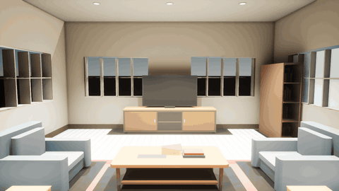

# The Lounge Handoff

One room, followed from a twelve-line recipe to a lit Cycles frame, a life-size Unreal level, a
walkable Godot project and a walkable web page. Everything in this repository is derived from
[`recipe.json`](recipe.json) by [mojulo](https://github.com/zombico/mojulo), a 3D factory for
agents: the agent builds worlds by conversation, as editable deterministic recipes, and the recipe
regenerates every file here on every read. Nothing below was authored by hand.

Live: the report at <https://zombico.github.io/lounge-handoff/> and the walkable room at
<https://zombico.github.io/lounge-handoff/walk/>. The five videos play on the report page under
"In motion".

| Where to look | What it is |
| --- | --- |
| [`index.html`](index.html) | The handoff report: recipe → kernel → three engines → four edits, with the gates verbatim. This is the GitHub Pages front page. |
| [`walk/`](walk/) | The room as a self-contained three.js page, mojulo's own web tier. It opens on the aerial cutaway; the buttons top-left switch to the corner framing, fly, or walk. In walk, WASD moves and the mouse looks. No build step, no server beyond static hosting. On Pages: `/walk/`. |
| [`videos/`](videos/) | Representation videos, see below. |
| [`packs/`](packs/) | The engine handoffs: `godot-lit/`, `unity-lit/`, `unreal/`, and the lit glTF on its own. |
| [`gates/`](gates/) | What each machine gate measured, verbatim: the Godot handback JSON and log, the Unreal and Unity import and verify logs, and the Unreal sequence-authoring and capture logs behind the two Unreal videos. |
| [`renders/`](renders/) | Cycles frames (day, night, dusk, before and after each edit), the two Godot frames from the kernel fix, the two Unreal frames from the importer fix plus an orbit and a night frame, and under `report/` the figures the report page shows. |

## The recipe

```json
{
  "title": "One-room house plan — living",
  "kind": "floorplan",
  "width": 24, "height": 28,
  "rooms": [{ "x": 2, "y": 2, "w": 20, "h": 24, "glyph": "L" }],
  "doors": [{ "x": 12, "y": 26, "room": 0, "edge": "S" }],
  "furnish": true,
  "view": "cutaway",
  "seed": 7,
  "potLights": true
}
```

Units are feet, because house plans are drawn in feet. Every export scales by 0.3048 so an engine
walker sees the room at life size, and the score says so twice on purpose: its numbers are already
metres, and `metersPerUnit` is provenance, never a second scale. The walker's eye is an adult's,
5.3 ft, and the spawn is the feet on the floor; the eye rides separately on the score.

This file is the stored recipe exactly, nothing derived in it. The floorplan mint grades a plan
to pick its seed and repair a stranded room, but the grade is no longer written into the
manifest; storing it once gave this room two hashes across three packs.

## Videos

| File | Renderer | What it shows |
| --- | --- | --- |
| `web-orbit.mp4` | mojulo web tier (three.js, headless WebGL) | A full orbit of the cutaway room from above. 48 frames, 12 fps. Recipe: `web-orbit.recipe.json`. |
| `web-flythrough.mp4` | mojulo web tier | Descends over the south wall, enters at the door, glides to the seating group. 96 frames, 12 fps. Recipe: `web-flythrough.recipe.json`. |
| `godot-walkthrough.mp4` (and a `.gif` preview for this page) | Godot 4.7, Forward+, kernel 0.2.1 | Two camera moves inside the lit pack: a push-in from the door toward the media wall, then an eye-height orbit of the seating group. 420 frames, 30 fps. Script: `godot-walkthrough.gd`. |
| `unreal-walkthrough.mp4` / `.gif` | Unreal 5.8, Lumen, the importer's sun and sky | The Godot script's two moves, same numbers, mapped through the leg's pinned frame map into a Level Sequence and rendered by the stock capture. 420 frames, 30 fps, no motion blur. Script: `unreal-cine.py`. |
| `unreal-day-to-night.mp4` / `.gif` | Unreal 5.8 | A fixed camera at the media wall while the importer's sun is keyed from mid-afternoon to below the horizon and the nine 400 cd spots are left to carry the room. The camera's exposure bias rides the sequence from 0 to −2.5 EV, the lever mojulo's night preset pulls; the pack does not change. 300 frames, 30 fps. Script: `unreal-cine.py`. |

The web-tier videos are motion recipes: mojulo's `forge_motion` re-renders them from the world
ref and the shot. The Godot one is a frame-indexed script over the exported pack, so a re-run gives
the same frames. The Unreal ones are the same idea in Unreal's vocabulary: `unreal-cine.py` builds
two Level Sequences in the scratch project the export gate wrote, keyed per frame, and the engine's
stock `-MovieSceneCaptureType` launch renders them to PNG. Each is a representation of the room,
not a game.



One preview here; the MP4s and the other GIFs play on the [report page](https://zombico.github.io/lounge-handoff/#motion).

## Gates

Two gates, never conflated. A machine measures the handoff; a person judges the picture.

| Engine | Machine gate | Eyes |
| --- | --- | --- |
| Blender Cycles | export driver ran, frames rendered | frames looked at |
| Unreal 5.8 | seven of seven checks, nine of nine lights, spawn in metres (`gates/unreal-verify.log`) | opened in the editor; two sequences rendered, frames looked at, one importer fix, rendered again |
| Godot 4.7 | import ×2, one-frame run, materials probe: 16 of 16 surfaces, 9 of 9 lights (`gates/godot-gate.json`) | walked; one frame looked at |
| Unity 6 | six of six verify checks, materials probe 14 shaded / 2 unlit / 9 lights as declared (`gates/unity-gate.json`) | not opened for this room; whether it reads the spots' candela at a sane brightness is unjudged |

What the eyes found that the machine could not: the black sky, the scale, the dead lens, the couch
facing the door, and a white room in Godot. The last one became a kernel fix (Godot kernel 0.2.1,
candela to engine energy plus a tonemapped environment); the report tells that story with before
and after frames.

The Unreal frames added one more. The glTF declares two materials unlit and alpha-blended, the
web tier's stickers: the contact shadows under the furniture and the window panes, whose
transparency rides the vertex alpha. The Unreal importer swapped all sixteen slots onto its
opaque lit master, so the shadows drew as grey blocks and the panes as solid glass. The gate line
`materials_unlit — 16 of 16` is the machine confirming that swap; Godot's importer keeps the two
unlit, which is why its gate says fourteen and two. The fix is in the importer (leg 0.4.2): it
reads the glTF's material table and gives those slots a third master, unlit and translucent.
Same pack, same gate count, soft shadows. The report shows the before and after frames as its
fourth edit. The floor is a separate matter, see held back.

## Re-mint

Everything here regenerates from the recipe. From a mojulo checkout, in `control/`:

```bash
export MOJULO_DATA_DIR="$(pwd)/data" MOJULO_OUTCOMES_DIR="$(pwd)/data/outcomes"
# mint the room (or reuse an existing ref) — the recipe is the create_sketch manifest
node scripts/mcp-stdio.mjs call create_sketch --json "$(cat recipe.json)"
# engine packs, each with its machine gate
node scripts/export-godot.mjs  --ref <ref> --lit
node scripts/export-unity.mjs  --ref <ref> --lit
node scripts/export-unreal.mjs --ref <ref> --lit
node scripts/export-blender.mjs --ref <ref>          # lit is its default base
# the walkable page
curl "http://localhost:3001/api/sketches/<ref>/world?download=1&walk=1" -o walk/index.html   # from a server running current source
# the web-tier videos
node scripts/mcp-stdio.mjs call forge_motion --json "$(cat videos/web-orbit.recipe.json)"
# the Godot walkthrough (writes a frame sequence next to the pack, then ffmpeg it at 30 fps)
godot --path packs/godot-lit --resolution 1280x720 --script ../../videos/godot-walkthrough.gd
# the Unreal shots: author the two Level Sequences in the gate's scratch project (no renderer needed) …
UE="/Users/Shared/Epic Games/UE_5.8/Engine/Binaries/Mac"; PROJ=data/outcomes/<ref>/unreal-scratch/Mojulo.uproject
"$UE/UnrealEditor-Cmd" "$PROJ" -run=pythonscript -script=videos/unreal-cine.py -unattended -nullrhi -nosplash
# … then render each with the stock capture (PNG frames out, ffmpeg after; ~40 s for the 420-frame walkthrough)
"$UE/UnrealEditor" "$PROJ" /Game/MojuloPack/Maps/mojulo-level -game -windowed -ResX=1280 -ResY=720 -ForceRes \
  -MovieSceneCaptureType="/Script/MovieSceneCapture.AutomatedLevelSequenceCapture" -LevelSequence="/Game/MojuloPack/Cine/LS_Walkthrough" \
  -MovieFolder=<frames dir> -MovieName="unreal-walkthrough.{frame}" -MovieFormat=PNG -MovieFrameRate=30 -MovieQuality=100 \
  -MovieWarmUpFrames=60 -MovieCinematicMode=Yes -NoLoadingScreen -NoScreenMessages -ExecCmds="r.MotionBlurQuality 0"
```

The `-game` launch needs a rendering Xcode: the Metal toolchain installed and selected, as the
mojulo Unreal plan records. The `UnrealEditor` launcher hands off to the app bundle and exits at
once, so a driver waits on the frame count, not the launcher's pid.

## Provenance

- Source ref `sk_lkypzdim4y`, manifest hash `fc95e0c38dd696a1`, the same in every pack and gate here.
- mojulo commit `14c3197` (2026-09-06) plus two uncommitted changes of 2026-09-08 in the working
  tree when this repository was assembled: Godot kernel 0.2.1 (candela to engine energy, a
  tonemapped environment) and the lounge-review fixes (grade not stored, adult eye height, spawn
  on the floor, the importer defects).
- Godot 4.7.2, Unreal 5.8, Blender Cycles.
- The Unreal videos were rendered 2026-09-09 from the scratch project the export gate wrote for
  this pack (its `MojuloPack/score.json` is byte-identical to `packs/unreal/score.json`), UE 5.8,
  Lumen, 1280 × 720 at 30 fps, `gates/unreal-cine-author.log` and `gates/unreal-capture.log`.
- The three engine packs and their gates were re-minted 2026-09-09 from mojulo commit `edeb1bd`
  plus the Unreal importer fix (leg 0.4.2) in the working tree. The Godot and Unity packs came
  back byte-identical; the Unreal pack's glTF differs from theirs in one buffer, the oak floor's
  V coordinates, flipped by mojulo commit `49f1380` so wrapped textures land right way up. Why the
  Godot and Unity legs did not pick that change up is not yet traced.

## Held back, honestly

- Unity passes its machine gate but nobody has opened this room in it, so no in-engine claim.
- The Godot divisor of fifty candela per unit was calibrated against one room and one pair of eyes.
- The web-tier pools under the cans are proven numerically, not judged by eye.
- The Blender GI bake exports faces only, so a baked lounge does not carry the pots yet.
- The Unreal importer fix (leg 0.4.2) is in the mojulo working tree, not yet committed, like the
  Godot kernel fix. Its sticker master is unlit by construction, matching the web tier's contract.
- The Unreal pack's glTF is not byte-identical to the Godot and Unity packs' (one buffer, the oak
  floor's V coordinates); see Provenance.
- No engine pack shows the oak grain. The glTF carries the floor as an untextured plank coat a
  millimetre above the textured oak; Godot and Unreal draw the coat (tan in one, white under
  Unreal's sun and auto-exposure), and only the Cycles frames show the grain. The first Unreal
  render after the sticker fix showed the oak because a fresh project had not finished building
  the coat's mesh; a re-run draws it, and the videos here are re-runs.
- The day-to-night shot keys the camera's exposure bias down 2.5 EV. That is a cinematography
  choice, disclosed in `unreal-cine.py`, not a property of the pack or the lights.

## License and credits

Apache-2.0, the same license as mojulo; see [`LICENSE`](LICENSE). The walkable page in `walk/`
bundles [three.js](https://threejs.org) (MIT, © 2010–2026 Three.js Authors) inline so it needs no
network. The engine packs contain generated code only; Godot, Unity and Unreal are not
redistributed here.
